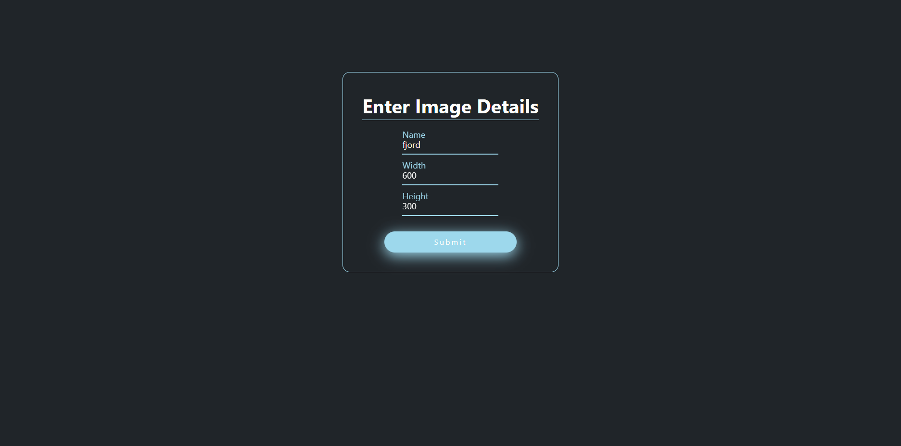
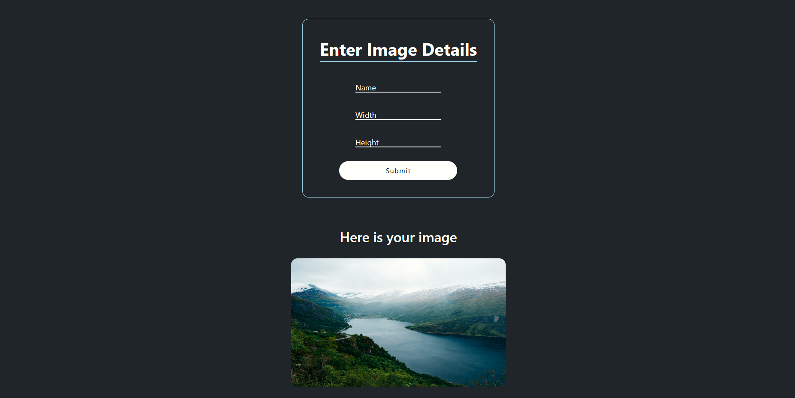

<br />
<div align="center">

  <h3 align="center">Image Resizer</h3>

  <p align="center">
    An awesome online tool to dynamically resize your images online
    <br />
    <br />
  </p>
</div>

<!-- TABLE OF CONTENTS -->
<details>
  <summary>Table of Contents</summary>
  <ol>
    <li>
      <a href="#about-the-project">About The Project</a>
      <ul>
        <li><a href="#built-with">Built With</a></li>
      </ul>
    </li>
    <li>
      <a href="#getting-started">Getting Started</a>
      <ul>
        <li><a href="#prerequisites">Prerequisites</a></li>
        <li><a href="#installation">Installation</a></li>
        <li><a href="#scripts">Scripts</a></li>
        <li><a href="#usage">Usage</a></li>
      </ul>
    </li>
    <li><a href="#contact">Contact</a></li>
    <li><a href="#acknowledgments">Acknowledgments</a></li>
  </ol>
</details>

<!-- ABOUT THE PROJECT -->

## About The Project




<p align="right">(<a href="#readme-top">back to top</a>)</p>

### Built With

-   <a href="nodejs.org">NodeJs<a/>
-   <a href="https://expressjs.com/">Express<a/>
-   <a href="react.js">React<a/>
-   <a href="https://getbootstrap.com//">Bootstrap<a/>
-   <a href="https://www.typescriptlang.org/">TypeScript<a/>

<p align="right">(<a href="#readme-top">back to top</a>)</p>

<!-- GETTING STARTED -->

## Getting Started


### Prerequisites

-   npm
-   NodeJs

### Installation

1. Clone the repo

    ```sh
    git clone https://github.com/Sayyfz/Image-Processing-App
    ```

2. Install NPM packages

Installing backend dependencies:

    cd/backend
    npm install

Installing frontend dependencies:

    cd/frontend
    npm install

<p align="right">(<a href="#readme-top">back to top</a>)</p>

### Scripts

<h3> Backend <h3/>
Development mode script:

```sh
npm run start
```

Production mode script:

```sh
npm run build
```

Running tests script:

```sh
npm run test
```

<h3> Frontend <h3/>

Dev mode script:

```sh
npm run start
```

Production mode script:

```sh
npm run build
```

### Usage

This Project is consisted of 2 projects, one for the Server made with Nodejs and Express and the other is for the Client that is made with React.
<br />
The server project is responsible for storing the images in the file system server-side and handle image processing on the fly through api endpoints.
<br />
While the Client project is responsible for entering image names that are stored on the server, resize the entered image with desired dimensions, and finally retrieve the image in the frontend preview.
<br />
<br />
The project can be used a standalone backend project and doesn't need to retrieve the data from the frontend, instead you can just run the backend server and enter the data directly in the url params or using a tool for api testing such as Postman.
<br />
Howeever, it is preferred to enter the data in the browser url instead of an api testing tool in order to see the image preview instead of some unreadable buffer data.

<!-- CONTACT -->

## Contact

Seif Ashraf - [https://www.linkedin.com/in/seif-elkady/](https://www.linkedin.com/in/seif-elkady/) - zedhasclout@gmail.com

Github Link: [https://github.com/Sayyf](https://github.com/Sayyf)

<p align="right">(<a href="#readme-top">back to top</a>)</p>

<!-- ACKNOWLEDGMENTS -->

## Acknowledgments

Use this space to list resources you find helpful and would like to give credit to. I've included a few of my favorites to kick things off!

-   [Sharp Package](https://www.npmjs.com/package/sharp)
-   [Font Awesome Icons](https://fontawesome.com/)
-   [Uiverse Html Elements](https://uiverse.io/)

<p align="right">(<a href="#readme-top">back to top</a>)</p>
